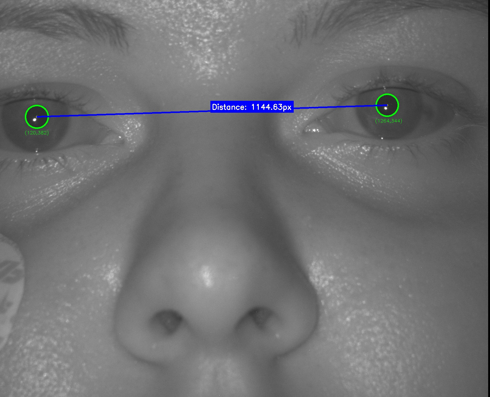
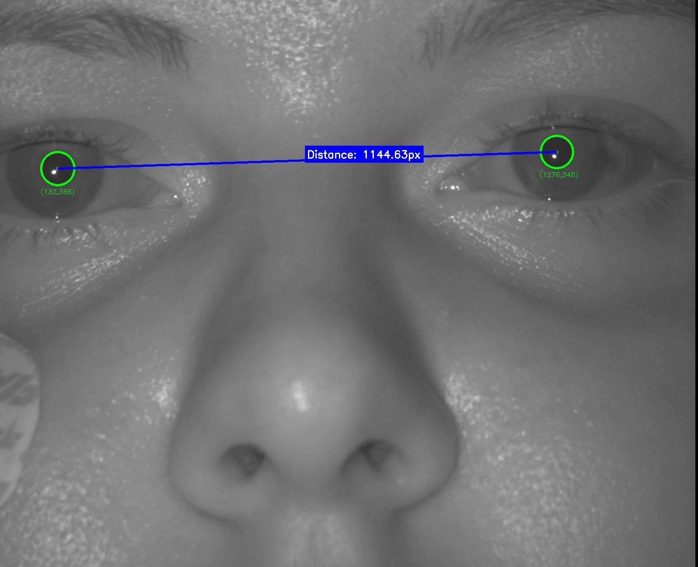
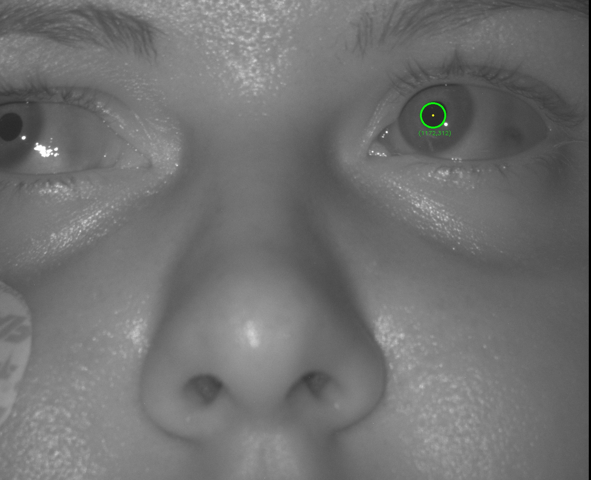
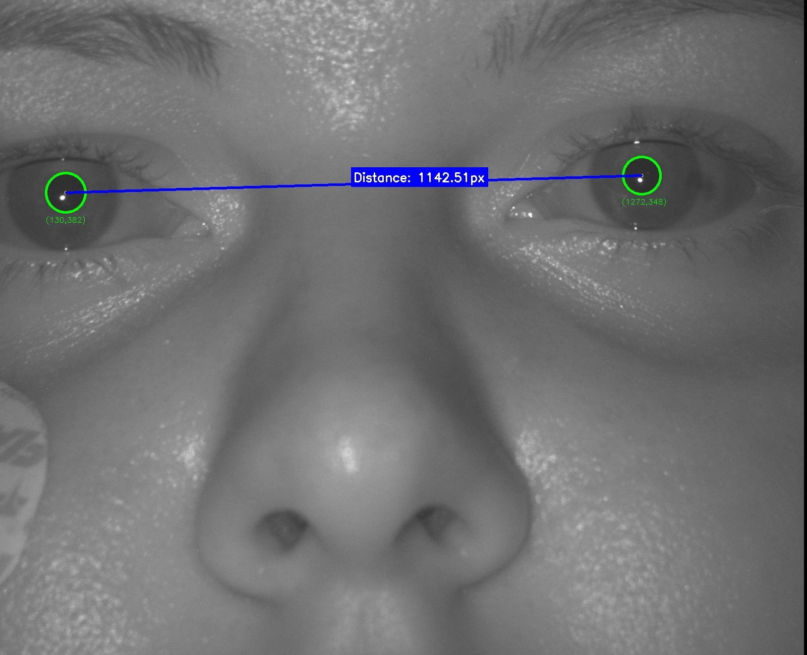
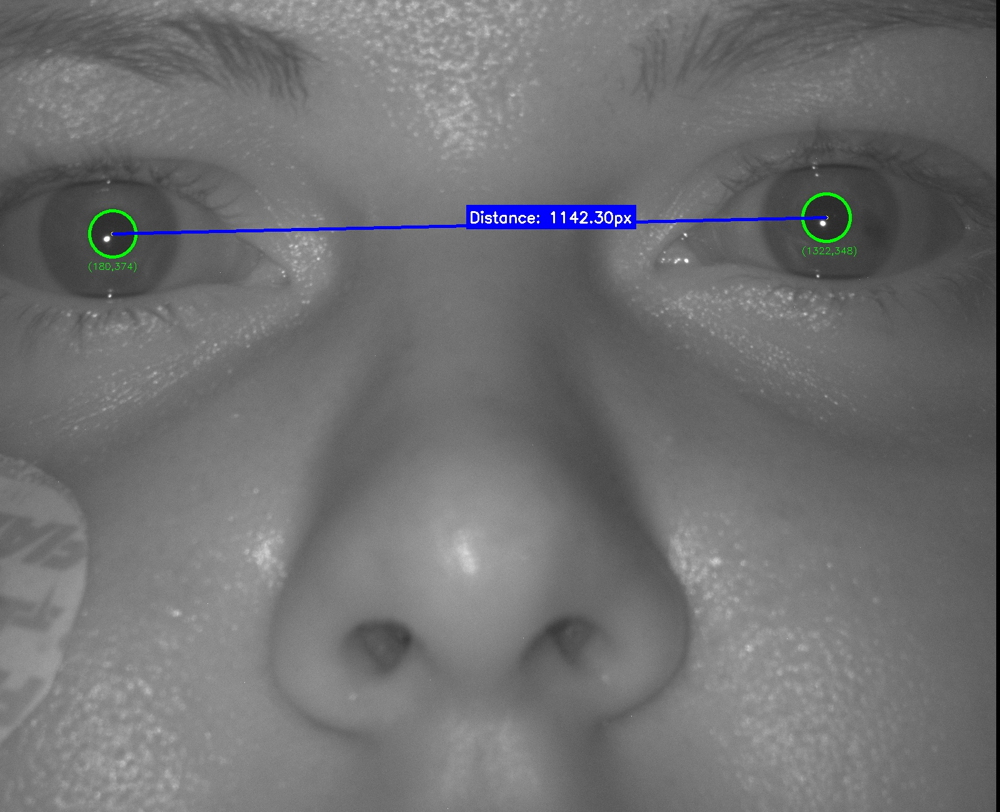
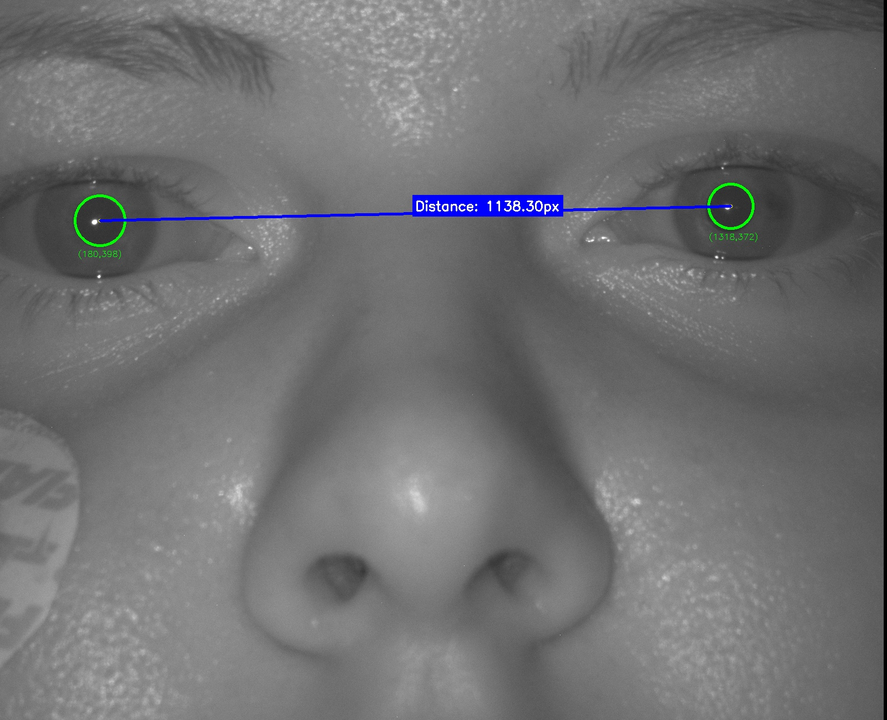

# 人臉瞳孔偵測 (Face Pupil Detection)

本專案旨在透過影像處理技術實作人臉中的瞳孔偵測，並進一步計算瞳孔間的幾何特徵。

## 🎯 作業目標 (Objectives)

1. **瞳孔定位**：準確圈出影像中瞳孔的範圍。
2. **距離計算**：計算左右瞳孔中心點之間的像素距離。

## 🛠 建議實作流程 (Methodology)

根據課堂筆記，建議使用以下影像處理技術進行開發：

### 1. 前處理與平滑化
*   **Gaussian Blur (高斯模糊)**：用於去除影像噪點，平滑圖像。

### 2. 特徵提取與分割
*   **Binarization (二值化)**：參考 **Histogram (直方圖)** 分佈進行門檻值分割。
*   **Sobel / Canny Operator**：進行邊緣檢測，找出瞳孔邊界。

### 3. 形狀偵測與定位
*   **Contour Detection (輪廓偵測)**：提取閉合區域。
*   **Hough Transform (霍夫變換)**：用於偵測圓形（瞳孔）。

### 4. 幾何校正與參考
*   **Perspective Transform (透視變換)**：校正人臉角度。
*   **Reference Point (參考點)**：設定基準點以提升偵測準確度。

## 🌟 加分項目 (Bonus)

*   **其他五官偵測**：除了瞳孔之外，擴展至眉毛、鼻子、嘴巴等其他臉部特徵點的偵測與標註。

## 🖼 實驗結果 (Results)

以下是偵測瞳孔後的結果範例：

| 範例 1 | 範例 2 |
| :---: | :---: |
|  |  |
|  |  |
|  |  |

---

## 🚀 開始使用

(此處可根據實際程式碼補充執行方式，例如 `python detect.py --image test.jpg`)
