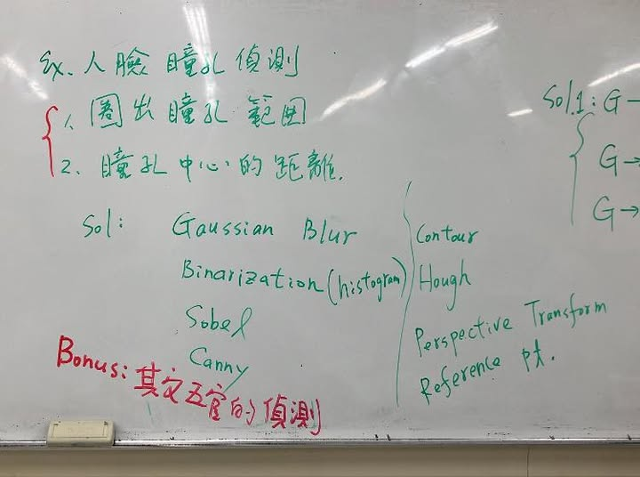
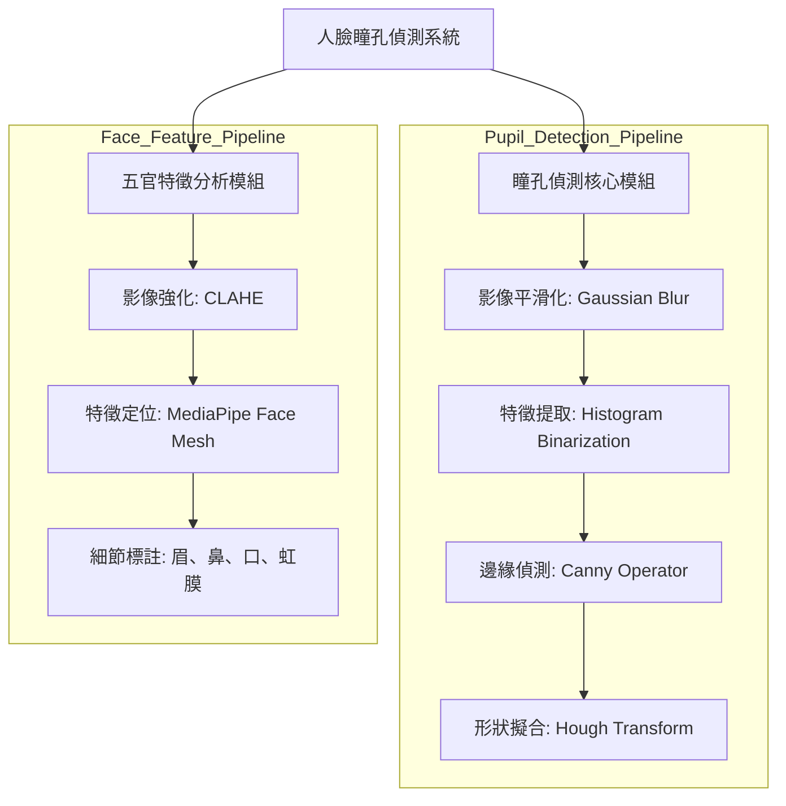
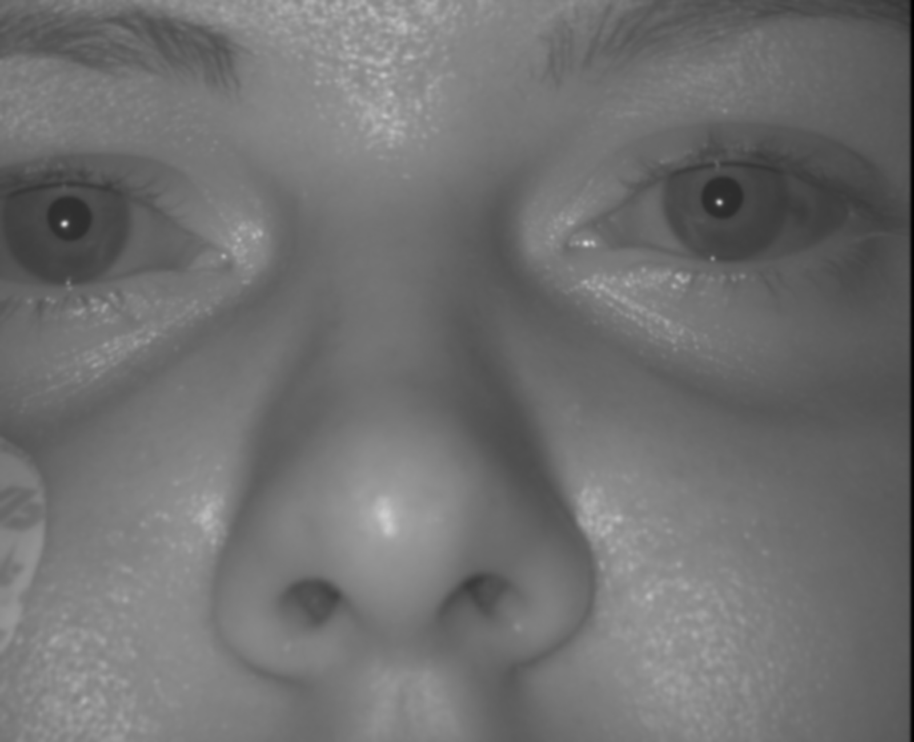
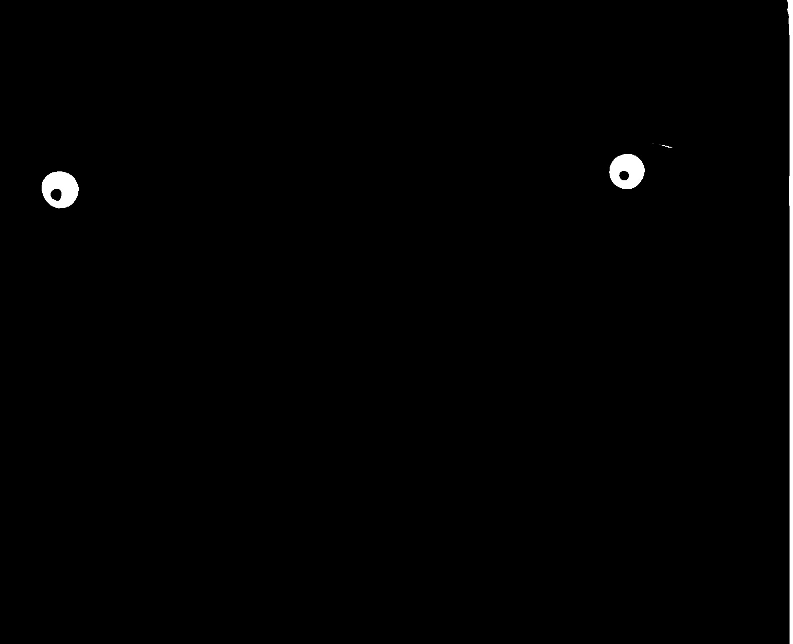
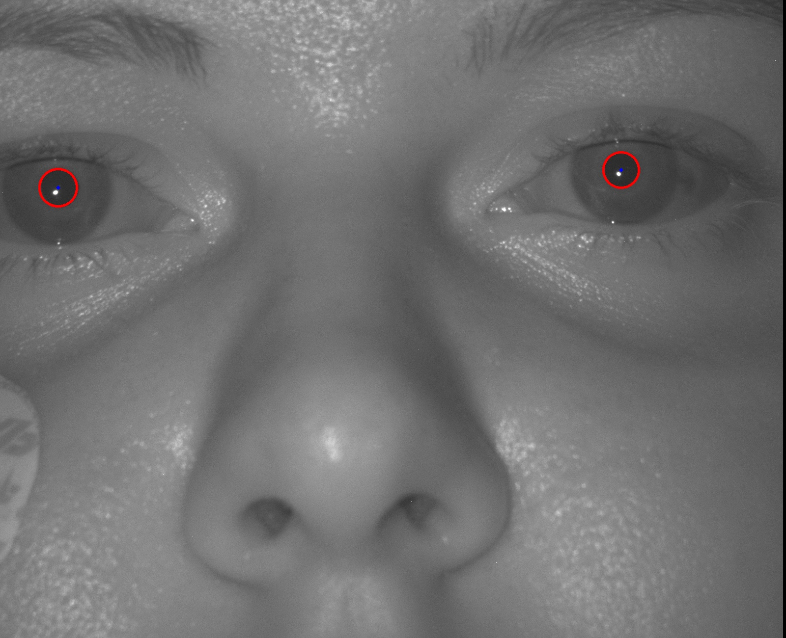
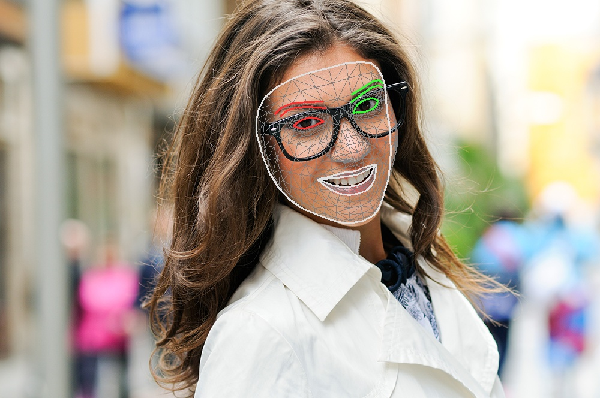

# 瞳孔偵測 

使用影像處理技術實作瞳孔偵測與幾何特徵計算。

## 需求
1. **影像解析度**：處理 1600x1300 高解析度近紅外線 (NIR) 影像。
2. **瞳孔定位**：標定影像瞳孔範圍。
3. **距離計算**：計算瞳孔中心像素距離。



## 設計 

### 系統架構 



### 核心演算法流程
*   **前處理**：使用高斯模糊   進行去噪與影像平滑。
*   **特徵提取**：基於直方圖的二值化   與 Canny/Sobel 邊緣偵測。
*   **形狀偵測**：利用輪廓偵測   與 霍夫變換   標定瞳孔圓心與半徑。
*   **幾何校正**：使用透視變換   校正人臉偏轉，並建立參考點   提升精度。

## 實驗結果演算法對照 (以單一影像為例)

| 處理階段 | 演算法成果 | 技術細節 |
| :--- | :---: | :--- |
| **原始影像** |  | 讀取原始 1600x1300 NIR 高解析度影像。 |
| **影像平滑化** |  | 透過 **Gaussian Blur** 降低高頻雜訊。 |
| **直方圖分割** |  | 基於 **Histogram** 分佈進行二值化門檻分割。 |
| **邊緣提取** |  | 使用 **Canny Operator** 擷取瞳孔輪廓邊界。 |
| **霍夫圓形擬合** |  | 透過 **Hough Circle Transform** 精確標定圓心。 |

## 加分項目
*   **五官偵測**：使用 MediaPipe 偵測並標註眉、鼻、口等臉部特徵點。



---

## 執行方式

### 瞳孔偵測
```bash
cd pupil_detection
python Code.py
```

### 五官特徵偵測
```bash
cd face_analysis
python face_features_detect.py
```

## 參考與致敬 
本專案的瞳孔偵測邏輯參考並改進自：
*   [Pupil-detection-on-python](https://github.com/bushranajeeb/Pupil-detection-on-python) by [bushranajeeb](https://github.com/bushranajeeb) - 感謝其在瞳孔特徵提取演算法上的啟發。
