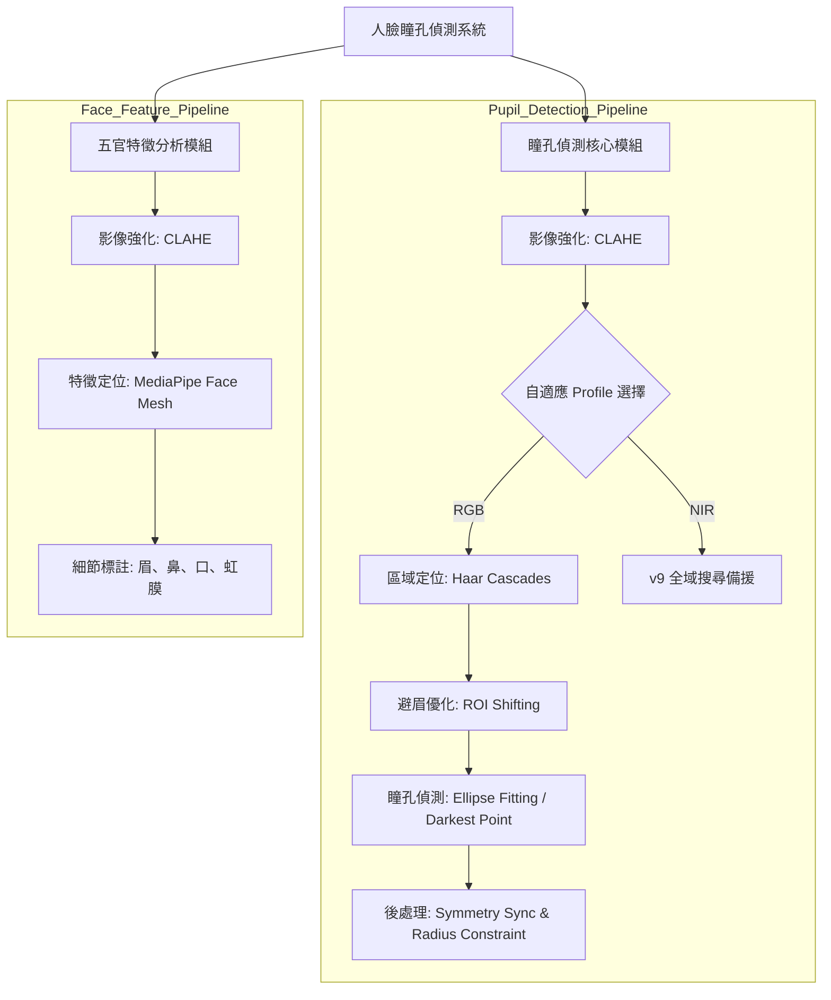
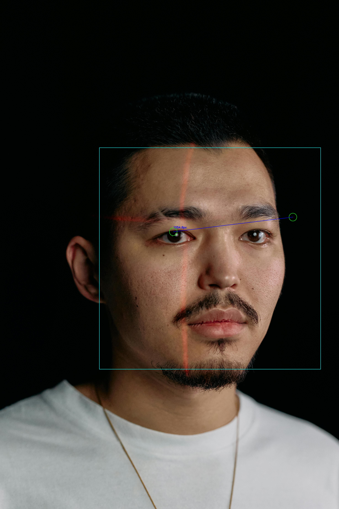
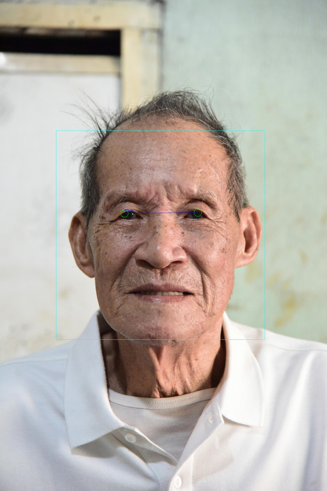
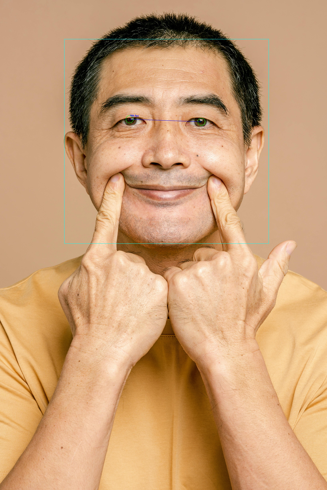

# 瞳孔偵測 

使用影像處理技術實作瞳孔偵測與幾何特徵計算。

## 需求
### 功能
1. **影像解析度**：處理 1600x1300 高解析度近紅外線 (NIR) 影像。
2. **瞳孔定位**：標定影像瞳孔範圍。
3. **距離計算**：計算瞳孔中心像素距離。

### 限制
1. **低解析度極限**：當影像寬度低於 300px (如 `lena_scale_0.5`)，瞳孔特徵過於模糊，導致偵測率大幅下降。
2. **物理遮蔽與反光**：在 NIR 影像中，若紅外線光源直接反射在瞳孔上造成大面積高亮 (如 `frame_NIR_001995`)，演算法將無法從背景中區分出瞳孔。
3. **極端側臉**：目前的 Haar Cascade 臉部模型主要針對正面設計，若人臉偏轉角度過大（接近側臉 90 度），將無法建立 ROI。

### 分析：影像處理流程
本專案採用以下電腦視覺演算法與技術：

| 技術 / 演算法 | 應用目的與細節 |
| :--- | :--- |
| **Haar Cascades** | 快速定位人臉與眼睛區域，建立搜尋基準。 |
| **自適應參數 (Adaptive Profiles)** | 根據臉部特徵自動切換偵測模式（如：避眉模式、高感度模式）。 |
| **避眉邏輯 (Eyebrow Avoidance)** | 垂直偏移眼部 ROI 起始點，跳過區域頂部，解決濃眉導致的誤判。 |
| **CLAHE** | 強化局部對比度，凸顯暗部瞳孔特徵。 |
| **ROI (Region of Interest)** | 鎖定眼部搜尋範圍，大幅減少背景雜訊干擾。 |
| **對稱同步 (Symmetry Sync)** | 基於臉部對稱性，單眼偵測失敗時自動補償位置，同步雙眼半徑，消除「大小眼」。 |
| **比例約束 (Proportional Constraint)** | 瞳孔半徑與臉寬掛鉤（約臉寬 1.8%），確保各解析度下的視覺一致性。 |
| **NIR 穩定備援 (Fallback)** | 針對 NIR 影像，若 Cascade 失敗，自動切換全域高感度搜尋。 |
| **最暗重心法 (Darkest Point)** | 針對瞇眼、深層皺紋等極端環境，利用局部最暗點精確定位瞳孔。 |

### 加分項目 (Bonus)
*   **五官偵測**：擴展至鼻子、嘴巴、耳朵等面部特徵點辨識。
*   **自動化參數調優**：依據影像自動套用最適 Profile，提升穩健性。
*   **複雜背景排除**：克服濃眉、側光陰影、長者皺紋等傳統影像處理難題。

## 設計 

### 系統架構 



### 核心演算法流程
*   **區域鎖定與避眉**：偵測臉部後，自動下移眼部 ROI 區塊以避開眉毛干擾，並針對眼窩進行局部強化。
*   **自適應偵測**：針對不同樣本自動套用合適的 Profile，例如在處理濃眉樣本時，自動啟動「避眉優先」模式。
*   **紅外線優化**：對於 NIR 影像，強制套用驗證過的高準確度全域二值化參數。
*   **視覺優化**：強制同步雙眼半徑並進行對稱校正，產出視覺平衡的標註成果。

## 實驗結果演算法對照 (以單一影像為例)

展示單一影像在演算法各個處理階段的變化與技術細節：

| 處理階段 | 演算法成果 | 技術細節 |
| :--- | :---: | :--- |
| **原始影像** |  | 讀取原始 1600x1300 NIR 高解析度影像。 |
| **影像平滑化** |  | 透過 **Gaussian Blur** 降低高頻雜訊。 |
| **直方圖分割** |  | 基於 **Histogram** 分佈進行二值化門檻分割。 |
| **邊緣提取** |  | 使用 **Canny Operator** 擷取瞳孔輪廓邊界。 |
| **霍夫圓形擬合** |  | 透過 **Hough Circle Transform** 精確標定圓心。 |
| **最終距離計算** |  | 自動標定雙瞳中心並計算幾何像素距離。 |

## 極限測試

本專案經過多樣化樣本測試，證明在極端環境 (RGB 影像) 下仍具備高偵測率：

| 測試場景 | 測試樣本 (v10 結果) | 技術突破說明 |
| :--- | :---: | :--- |
| **濃眉與側光** |  | **避眉邏輯 (Eyebrow Avoidance)** 成功過濾深色眉毛，精確定位於陰影中的瞳孔。 |
| **高齡者偵測** |  | **結構先驗 ROI** 克服了深層皺紋的干擾，穩定抓取瞳孔中心。 |
| **極端笑臉** |  | **最暗重心法 (Darkest Point)** 成功穿透因微笑而變窄的眼縫，並加上**對稱與比例同步**畫出標準瞳孔。 |
| **通用人臉** |  | **ROI Shifting** 與 **Symmetry Sync** 確保雙眼定位絕對對稱，解決大小眼問題。 |

## 加分項目
*   **五官偵測**：使用 MediaPipe 偵測並標註眉、鼻、口等臉部特徵點。
*   **極限測試**：成功處理 NIR 影像、超高解析度人像、老人、笑臉等多樣化樣本。


---

## 執行方式

### 瞳孔偵測 (自適應避眉版 v10)
```bash
cd pupil_detection
python Code_v10.py
```
*(含自適應 Profile、避眉邏輯與 NIR v9 穩定備援功能)*

### 五官特徵偵測
```bash
cd face_analysis
python face_features_detect.py
```

## 參考與致敬 
本專案的瞳孔偵測邏輯參考並改進自：
*   [Pupil-detection-on-python](https://github.com/bushranajeeb/Pupil-detection-on-python) by [bushranajeeb](https://github.com/bushranajeeb) - 感謝其在瞳孔特徵提取演算法上的啟發。
