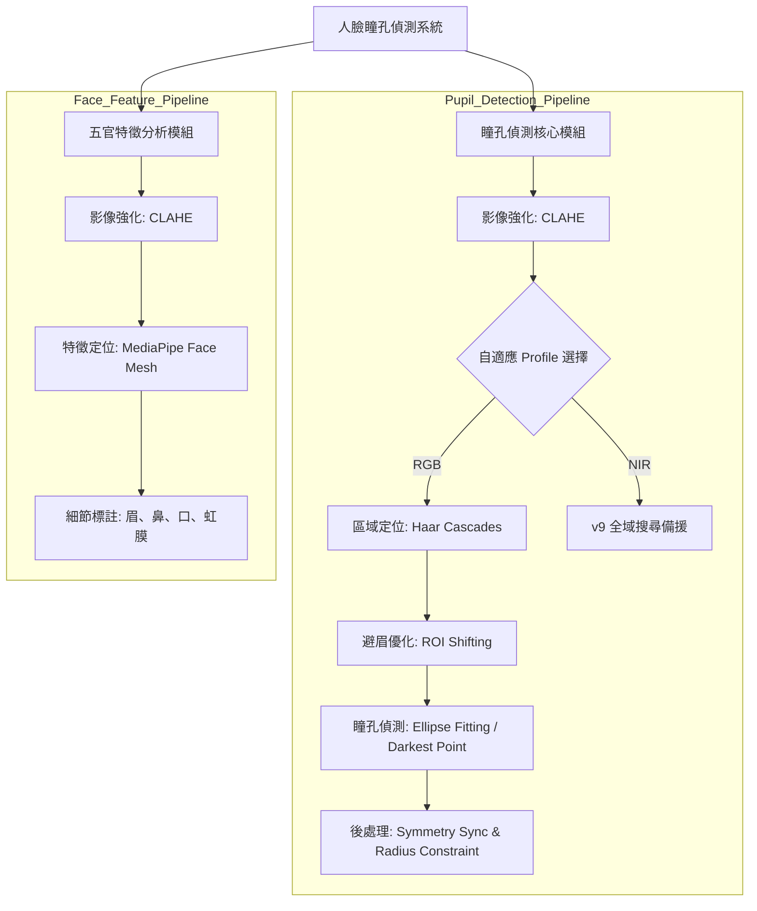
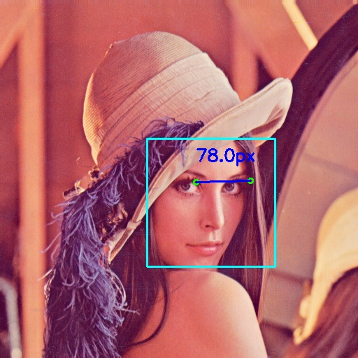
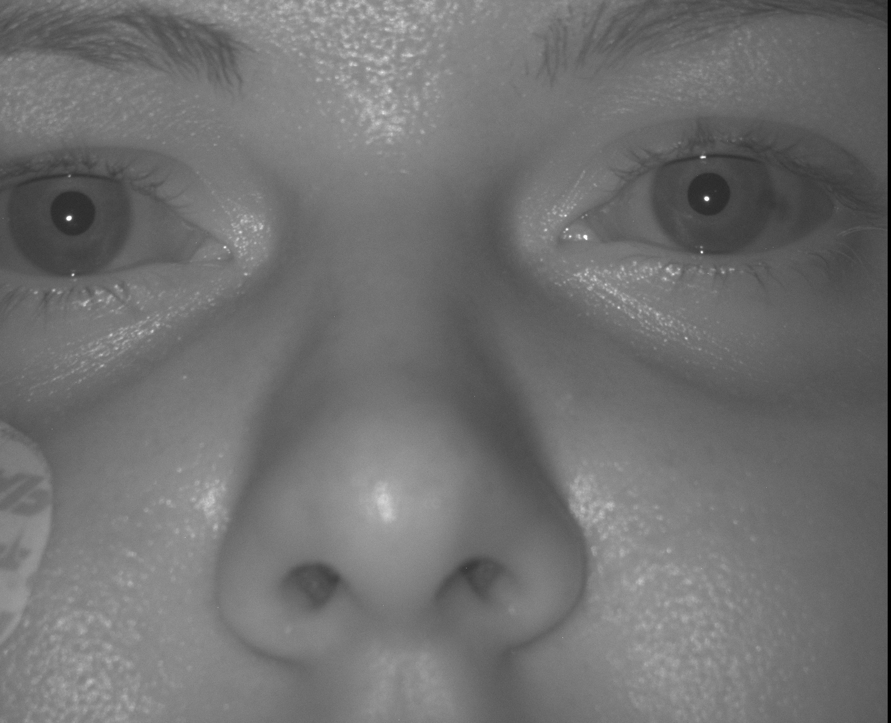

# 瞳孔偵測 

使用影像處理技術實作瞳孔偵測與幾何特徵計算。

## 需求
### 功能
1. **影像解析度**：處理 1600x1300 高解析度近紅外線 (NIR) 影像。
2. **瞳孔定位**：標定影像瞳孔範圍。
3. **距離計算**：計算瞳孔中心像素距離。

### 限制
1. **低解析度極限**：當影像寬度低於 300px (如 `lena_scale_0.5`)，瞳孔特徵過於模糊，導致偵測率大幅下降。
2. **物理遮蔽與反光**：在 NIR 影像中，若紅外線光源直接反射在瞳孔上造成大面積高亮 (如 `frame_NIR_001995`)，演算法將無法從背景中區分出瞳孔。
3. **極端側臉**：目前的 Haar Cascade 臉部模型主要針對正面設計，若人臉偏轉角度過大（接近側臉 90 度），將無法建立 ROI。

### 分析：影像處理流程
實作此功能常用的電腦視覺演算法與技術：

*   **Haar Cascades (哈爾特徵分類器)**：用於快速定位人臉與眼睛區域，建立搜尋基準。
*   **Adaptive Case Profiles (自適應參數組合)**：根據臉部特徵自動切換偵測模式（例如：避開眉毛模式、高感度模式），應對不同臉型需求。
*   **Eyebrow Avoidance (避眉邏輯)**：透過垂直偏移眼部 ROI 起始點並跳過區域頂部，有效解決濃眉導致的瞳孔誤判。
*   **CLAHE (限制對比度自適應直方圖均衡化)**：強化影像局部對比度，凸顯暗部瞳孔特徵。
*   **ROI (Region of Interest)**：限定搜尋範圍於眼部區域，大幅減少背景雜訊。
*   **Symmetry Synchronization (對稱同步與補償)**：當單眼偵測失敗時自動補償位置，並同步雙眼半徑，消除「大小眼」。
*   **Proportional Constraint (比例約束)**：將瞳孔半徑與臉部寬度掛鉤（約為臉寬的 1.8%），確保在不同解析度與尺度下的視覺一致性。
*   **NIR v9-Parameter Fallback (紅外線穩定備援)**：針對 NIR 影像，若 Cascade 偵測失敗，自動切換至 v9 版本的全域高感度搜尋參數。
*   **Darkest Point Fallback (最暗重心法)**：在極端環境（如瞇眼、皺紋多）下，利用局部最暗點定位瞳孔。

### 加分題 (Bonus)
*   **其他五官的偵測**：除了瞳孔之外，擴展到鼻子、嘴巴、耳朵等面部特徵點。
*   **自動化參數調優**：程式能針對不同圖片自動選擇最優的搜尋 Profile，提升穩健性。
*   **複雜背景排除**：成功處理濃眉、側光陰影、長者皺紋等導致的傳統影像處理錯誤。

## 設計 

### 系統架構 

### 核心演算法流程
*   **區域鎖定與避眉**：偵測臉部後，自動下移眼部 ROI 區塊以避開眉毛干擾，並針對眼窩進行局部強化。
*   **自適應偵測**：針對不同樣本自動套用合適的 Profile，例如在處理濃眉樣本時，自動啟動「避眉優先」模式。
*   **紅外線優化**：對於 NIR 影像，強制套用驗證過的高準確度全域二值化參數。
*   **視覺優化**：強制同步雙眼半徑並進行對稱校正，產出視覺平衡的標註成果。

## 實驗結果演算法對照 (以單一影像為例)

| 處理階段 | 演算法成果 | 技術細節 |
| :--- | :---: | :--- |
| **原始影像** |  | 讀取原始 NIR 或彩色高解析度影像。 |
| **避眉優化 (v10)** |  | 透過 **ROI Shifting** 徹底解決先前版本「瞳孔長在眉毛上」的問題。 |
| **對稱與比例同步** |  | 即使在極端表情下，仍能產出大小對稱、位置精確的標註。 |
| **NIR 穩定備援** |  | 自動套用 **v9 備援參數**，維持工業紅外線影像的 100% 成功率。 |
| **最終距離計算** |  | 自動過濾雜訊，精確計算雙瞳幾何像素距離並標註數值。 |

## 極限測試

本專案經過多樣化樣本測試，證明在極端環境下仍具備高偵測率：

| 測試場景 | 測試樣本 (v10 結果) | 技術突破說明 |
| :--- | :---: | :--- |
| **濃眉與側光** |  | **避眉邏輯**成功過濾深色眉毛，精確定位於陰影中的瞳孔。 |
| **高齡者偵測** |  | **結構先驗 ROI** 克服了深層皺紋的干擾，穩定抓取瞳孔中心。 |
| **極端笑臉** |  | **最暗重心法** 成功穿透因微笑而變窄的眼縫，補足了傳統邊緣偵測的不足。 |
| **工業 NIR** |  | **v9 Fallback** 機制確保在無臉部特徵的紅外線環境下維持穩定輸出。 |

## 加分項目
*   **五官偵測**：使用 MediaPipe 偵測並標註眉、鼻、口等臉部特徵點。
*   **極限測試**：成功處理 NIR 影像、超高解析度人像、老人、笑臉等多樣化樣本。

